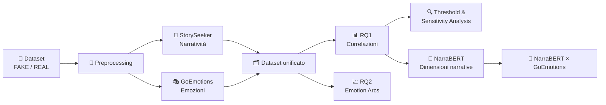

<div align="center">

# 🧠 Narratività & Emozioni nelle Fake News

### Analisi comparativa tra articoli **FAKE** e **REAL** con modelli NLP

<br>


<br>

**StorySeeker · GoEmotions · NarraBERT**

<br>

> Un progetto di analisi testuale che studia **quanto** una notizia è narrativa,  
> **quali emozioni** contiene e **come l'intensità emotiva evolve** lungo il testo.

</div>

---

## ✨ Overview

Il progetto analizza la relazione tra **narratività** ed **emozioni** negli articoli di notizie, confrontando contenuti classificati come **FAKE** e **REAL**.

L'analisi combina modelli NLP e metodi statistici per rispondere a due domande principali:

<table>
<tr>
<td width="50%" valign="top">

### 🔎 RQ1 — Narratività & Emozioni

Esiste una relazione tra il livello di narratività di un articolo e la sua intensità emotiva?

</td>
<td width="50%" valign="top">

### 📈 RQ2 — Emotion Arcs

Gli articoli narrativi FAKE mostrano un andamento emotivo diverso rispetto ai REAL?

</td>
</tr>
</table>

---

## 🧩 Pipeline



---

## 🤖 Modelli utilizzati

| Modello | Ruolo | Output principale |
|:--|:--|:--|
| **StorySeeker** | Misura la narratività globale | `First`, `Mean`, `Max` |
| **GoEmotions** | Stima le emozioni nel testo | 27 probabilità emotive |
| **NarraBERT** | Analizza dimensioni narrative specifiche | 9 dimensioni narrative |

### StorySeeker
Misura **quanto un testo è narrativo**.

Gli articoli lunghi vengono elaborati tramite chunk sovrapposti e aggregati a livello di articolo.

### GoEmotions
Stima la presenza di più emozioni contemporaneamente tramite classificazione multilabel.

Nel progetto vengono considerate **27 emozioni non neutrali**.

### NarraBERT
Descrive **in quali aspetti un testo è narrativo**, attraverso 9 dimensioni:

`Focalization` · `Emotion` · `Cognition` · `Change of State` · `Conflict` · `Concreteness` · `Temporal Grounding` · `Spatial Grounding` · `Sensory`

---

## 📚 Dataset

Dopo il preprocessing:

<div align="center">

| Totale | FAKE | REAL |
|:--:|:--:|:--:|
| **33.743** | **16.109** | **17.634** |

</div>

Sono stati rimossi:

- articoli vuoti;
- duplicati;
- testi con meno di 100 parole.

> [!IMPORTANT]
> Le categorie tematiche non sono distribuite nello stesso modo tra FAKE e REAL.  
> Per questo motivo il progetto include analisi dedicate all'effetto della composizione del campione.

---

## 🎭 Emotion Strength

Per sintetizzare il profilo emotivo di ogni articolo vengono considerate tre misure:

<table>
<tr>
<td align="center" width="33%">

### MAX
Emozione con probabilità più alta

**Main analysis**

</td>
<td align="center" width="33%">

### TOP-3 MEAN
Media delle tre emozioni più forti

**Sensitivity analysis**

</td>
<td align="center" width="33%">

### RMS
Considera l'intero profilo emotivo

**Sensitivity analysis**

</td>
</tr>
</table>

---

## 📊 RQ1 — Narratività ed emozioni

La relazione tra narratività globale ed Emotion Strength viene studiata tramite **correlazione di Spearman**.

<div align="center">

| Gruppo | Spearman ρ |
|:--|--:|
| **ALL** | **-0.033** |
| **FAKE** | **-0.064** |
| **REAL** | **-0.124** |

</div>

### Risultato

> La relazione globale tra narratività ed intensità emotiva è **negativa ma molto debole**.

Il risultato rimane sostanzialmente stabile anche modificando:

- la misura di narratività;
- la definizione di Emotion Strength.

---

## 🎚️ Threshold Analysis

Sono state analizzate soglie crescenti di narratività:

`0.30` → `0.50` → `0.70` → `0.80` → `0.90`

L'obiettivo è verificare se la relazione tra narratività ed emozioni diventi più evidente considerando solo gli articoli più narrativi.

### Cosa emerge

- la quota di articoli FAKE cresce alle soglie più alte;
- l'Emotion Strength bilanciata rimane pressoché stabile;
- la correlazione globale non diventa più forte;
- alcune **singole emozioni** cambiano invece con la narratività.

> **Più narratività non significa necessariamente più emozione, ma può significare emozioni diverse.**

---

## 🧠 NarraBERT × GoEmotions

Per andare oltre la narratività globale, vengono correlate le **9 dimensioni NarraBERT** con le **27 emozioni GoEmotions**.

<div align="center">

### 9 × 27 = **243 associazioni per gruppo**

</div>

Esempio:

```text
Conflict × Anger  →  ρ ≈ 0.53
```

Negli articoli con valori più alti di **Conflict**, tende ad aumentare anche il punteggio associato ad **Anger**.

### Pattern principali

<table>
<tr>
<td width="50%" valign="top">

### 🔴 FAKE

Emergono soprattutto associazioni tra:

- **Conflict**
- **Emotion**

e:

- Anger
- Annoyance
- Disgust

</td>
<td width="50%" valign="top">

### 🔵 REAL

Emergono soprattutto associazioni tra:

- **Change of State**
- **Conflict**

e:

- Grief
- Sadness
- Anger

</td>
</tr>
</table>

---

## 📈 RQ2 — Emotion Arcs

Per la seconda Research Question vengono selezionati gli articoli con:

```text
Narratività ≥ 0.50
```

<div align="center">

| Totale | FAKE | REAL |
|:--:|:--:|:--:|
| **11.974** | **7.460** | **4.514** |

</div>

Ogni articolo viene diviso in **5 sezioni normalizzate**:

```text
inizio                                         fine
  │                                             │
  ▼                                             ▼
 S1 ───── S2 ───── S3 ───── S4 ───── S5
```

Per ogni sezione viene calcolata l'Emotion Strength.

---

## 📉 Arco originale vs arco centrato

### Arco originale
Mantiene contemporaneamente:

- livello emotivo;
- forma dell'andamento.

### Arco centrato
Rimuove il livello emotivo medio di ciascun articolo e mette in evidenza la **forma relativa dell'arco**.

### Risultato

Gli articoli FAKE mostrano:

- Emotion Strength maggiore in tutte le sezioni;
- un calo più evidente nella seconda sezione;
- una crescita più marcata verso la parte finale;
- un picco finale più pronunciato rispetto ai REAL.

---

## 🧪 Validazione statistica

| Metodo | Obiettivo |
|:--|:--|
| **Mann–Whitney U** | Confronto FAKE/REAL in ogni sezione |
| **Cliff's delta** | Dimensione dell'effetto |
| **Permutation Test** | Confronto globale degli archi |

Il permutation test è stato eseguito con **5.000 permutazioni**.

<div align="center">

### `p = 0.0002`

sia per l'arco originale sia per quello centrato.

</div>

---

## 🗂️ Struttura del progetto

```text
RG_FND/
│
├── data/
│   ├── raw/                  # dataset originali
│   ├── interim/              # dati intermedi
│   └── processed/            # dataset e risultati finali
│       ├── rq1/
│       ├── rq1_narrabert/
│       └── rq2/
│
├── src/
│   ├── emotions/             # inferenza GoEmotions
│   ├── narrativity/          # StorySeeker / NarraBERT
│   ├── rq1/                  # analisi RQ1
│   └── rq2/                  # emotion arcs e analisi RQ2
│
└── README.md
```

---

## ♻️ Riproducibilità

La pipeline salva gli output intermedi in CSV, permettendo di:

- evitare di rieseguire ogni volta i modelli NLP;
- ripartire direttamente dai dati già processati;
- sviluppare nuove analisi statistiche;
- produrre nuovi grafici;
- estendere il progetto senza modificare le fasi precedenti.

> [!TIP]
> Le analisi successive possono essere eseguite direttamente sui file presenti in `data/processed/` quando non è necessario ripetere l'inferenza dei modelli.

---

## 🚀 Sviluppi futuri

<table>
<tr>
<td align="center" width="33%">

### 🌐 Dataset diversi
Validare i risultati su raccolte più ampie ed eterogenee.

</td>
<td align="center" width="33%">

### 🎯 Controllo tematico
Ridurre l'effetto dovuto a categorie e argomenti distribuiti diversamente tra FAKE e REAL.

</td>
<td align="center" width="33%">

### 🌍 Multilingua
Estendere la pipeline a notizie in lingue diverse.

</td>
</tr>
</table>

---

## 📎 Riferimenti principali

- **Fake and Real News Dataset (ISOT)** — Kaggle
- **StorySeeker** — *Where Do People Tell Stories Online? Story Detection Across Online Communities*
- **GoEmotions** — *A Dataset of Fine-Grained Emotions*
- **SamLowe / roberta-base-go_emotions**
- **NarraBERT** — *Characterizing Narrative Content in Web-scale LLM Pretraining Data*

---

<div align="center">

## 🎓 Academic Project

**Internet Data Analysis**

---

**StorySeeker · GoEmotions · NarraBERT**

</div>
